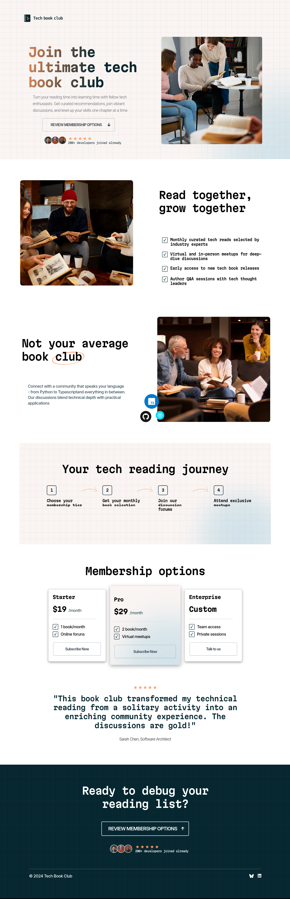

# Frontend Mentor - Tech book club landing page solution

This is a solution to the [Tech book club landing page challenge on Frontend Mentor](https://www.frontendmentor.io/challenges/tech-book-club-landing-page-fZQidjHU73). Frontend Mentor challenges help you improve your coding skills by building realistic projects.

## Table of contents

- [Overview](#overview)
  - [The challenge](#the-challenge)
  - [Screenshot](#screenshot)
  - [Links](#links)
- [My process](#my-process)
  - [Built with](#built-with)
  - [What I learned](#what-i-learned)
  - [Continued development](#continued-development)
  - [Useful resources](#useful-resources)
- [Author](#author)
- [Acknowledgments](#acknowledgments)

## Overview

### The challenge

Users should be able to:

- View the optimal layout for the interface depending on their device's screen size
- See hover and focus states for all interactive elements on the page

### Screenshot



### Links

- Solution URL: [Add solution URL here](https://github.com/ttsoares/tech-book-club)
- Live Site URL: [Add live site URL here](https://bookclub.expo.app)

## My process

### Built with

- React Native with Expo Go
- Nativewind for Web
- Desktop-first workflow
- [React Native](https://reactnative.dev/) - JS framework.
- [Nativewind](https://www.nativewind.dev) - TailwindCSS for React Native.
- [Expo Go](https://expo.dev/) - Universal native apps with React that run on Android, iOS, and the web.

### What I learned

The Nativewind framework yet lacks all the functionalities of Tailwind so, in several ocasions the only solution was to use in-line styles.

```JSX
 <ImageBackground
    source={require('../assets/images/pattern-light-bg.png')}
    className="relative h-full flex-1 items-center justify-center overflow-hidden md:p-10"
    resizeMode="cover"
    style={{ flex: 1, width: '100%', height: '100%' }}>
```

### Continued development

My goal right now is to gain familiarity with React Native and the limitations imposed by styling with Nativewind, since I plan to use it for cross-platform development. So far, I’ve only tested this project for web, but in the next one, I’ll also try generating native Android code.

### Useful resources

- [Expo Go](https://www.youtube.com/watch?v=XgWENEf3oFw&list=PLC3y8-rFHvwgVmqbtQkPDxkvDf6w5_eGA) - Frontend Made Easy.
- [Nativewind](https://www.nativewind.dev/getting-started/installation) - Documentation.

## Author

- Website - [Thomas TS](https://buildesign.vercel.app/)
- Frontend Mentor - [@ttsoares](https://www.frontendmentor.io/profile/ttsoares)
- Linkedin - [thomas-soares-6791781b/](https://www.linkedin.com/in/thomas-soares-6791781b/)

## Acknowledgments

In many situations, mentoring from ChatGPT and DeepSeek proved incredibly useful. The AI (Windsurf) in my IDE also provided highly pertinent code suggestions. The days of ‘Googling’ for solutions are officially over!
